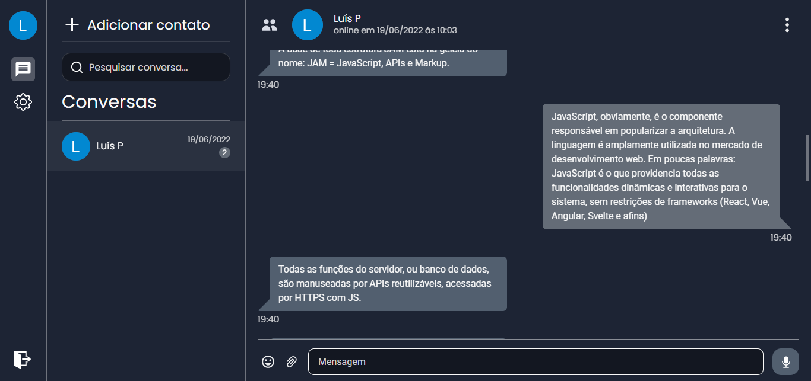
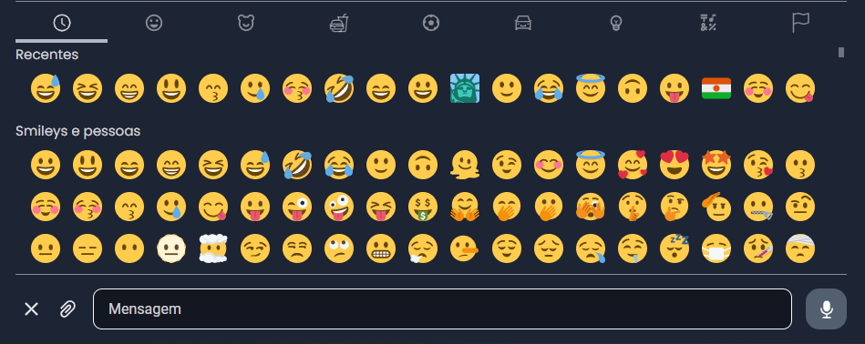
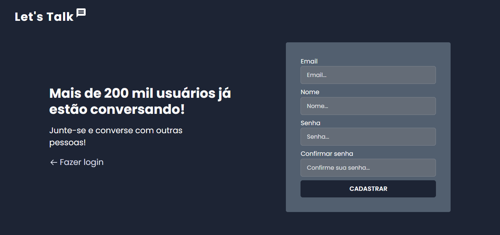
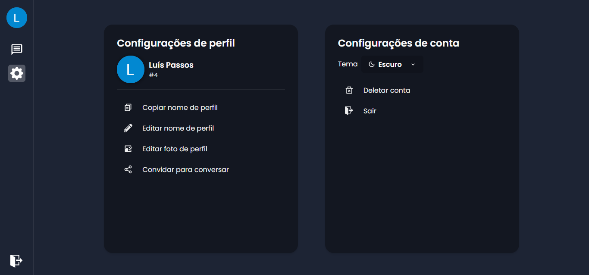
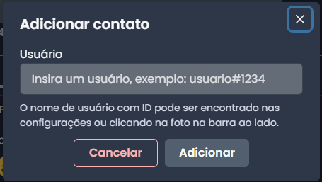
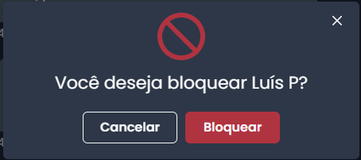
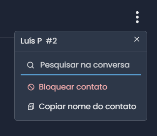

  

  
  
   

## :computer: Project

Let's Talk is a web chat app like Whatsapp Web, with features like:

- Login and registration
- Custom emojis :grinning:
- File upload
- Real-time messages
- ID system for adding contacts
- Data change
  - Email
  - Password
  - Nickname
  - Profile picture
- Dark/Light theme
- Password recovery system if user forgets his password
- Contact blocking system
- CTRL + F for searching in the conversation
- Unit tests with Jest
- Server side rendering with Next JS
- Progressive Web App

## :rocket: Technologies

- [Typescript](https://www.typescriptlang.org/)
- [Firebase](https://firebase.google.com/?hl=en)
- [React](https://reactjs.org/)
- [Next JS](https://nextjs.org/)
- [Chakra UI](https://chakra-ui.com/)
- [React Hook Form](https://react-hook-form.com/)
- [Jest](https://jestjs.io/)
- [PWA](https://developer.mozilla.org/en-US/docs/Web/Progressive_web_apps)
- [ESLint](https://eslint.org/)

## :camera: Images

 
    

## :dart: Future Features

- [ ] see color highlighting on pages
- [ ] test the entire application in production
- [ ] make jest tests
- [ ] optimize application
- [ ] see firebase rules
- [ ] make env.example
- [ ] test if when adding a contact, the contact immediately receives who made contact
- [ ] use react hook query
- [ ] see if name is updated in the conversation list
- [ ] see storage rules
- [ ] test conversations after account is deleted
- [ ] make unreade message
- [ ] see conversation blocking
- [ ] see test coverage
- [ ] see emojis throughout the app, especially this one :eye_speech_bubble:
- [ ] see selected bar disappear in the emoji picker after perfomed
- [ ] see page going to production
- [ ] see github copilot
- [ ] delete htmls
- [ ] see emoji selection
- [ ] see screen reader

### Next Project

- [ ] Mobile First
- [ ] All components in folders
- [ ] see REMS in the chakra to improve responsiveness
- [ ] make my template next js
- [ ] use create-pwa in the next project
- [ ] put lang attribute in the html
- [ ] make db actions or payment in the api route
