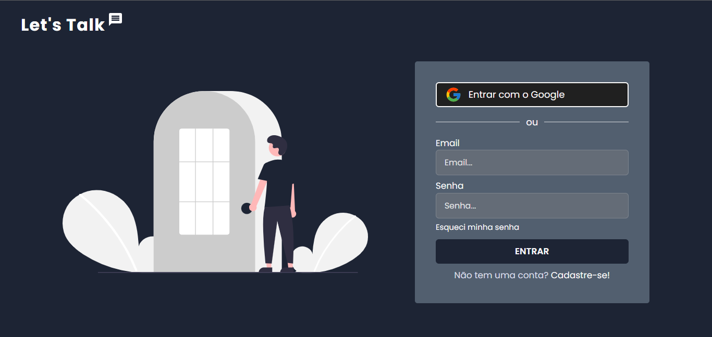

  

  
  
   

## :computer: Project

https://letstalk-chat.vercel.app/

Let's Talk is a web chat app like Whatsapp Web, with features like:

- Login and registration
- Custom emojis :grinning:
- File upload
- Real-time messages
- ID system for adding contacts
- Data change
  - Email
  - Password
  - Nickname
  - Profile picture
- Dark/Light theme
- Password recovery system if user forgets his password
- Contact blocking system
- CTRL + F for searching in the conversation
- Unit tests with Jest

## :rocket: Technologies

- [Typescript](https://www.typescriptlang.org/)
- [Firebase](https://firebase.google.com/?hl=en)
- [React](https://reactjs.org/)
- [Next JS](https://nextjs.org/)
- [Chakra UI](https://chakra-ui.com/)
- [React Hook Form](https://react-hook-form.com/)
- [Jest](https://jestjs.io/)
- [PWA](https://developer.mozilla.org/en-US/docs/Web/Progressive_web_apps)
- [ESLint](https://eslint.org/)

## :dart: Future Features

- [ ] see color highlighting on pages
- [ ] test the entire application in production
- [ ] make jest tests
- [ ] optimize application
- [ ] see firebase rules
- [ ] make env.example
- [ ] test if when adding a contact, the contact immediately receives who made contact
- [ ] use react hook query

- ver se nome é atualizado na lista de conversas
- ver regras do storage
- testar conversas depois que a conta for excluida
- fazer unread messages
- ver bloqueamento na conversa
- ver coverage dos testes
- ver emojis em toda a aplicação, principalmente esse 👁️‍🗨️
- ver barra de selecionado desaparecer no emoji picker dps de ele tiver performado
- ver pagina going to production
- ver github copilot
- delete htmls
- see emoji selection

# NEXT PROJECT

- Mobile First
- Componentes todos em pastas
- ver REMS no chakra pra melhor responsividade
- Fazer my template next js
- usar create pwa no proximo projeto
- colocar atributo lang no html
- fazer ações do db ou pagamento no api route
